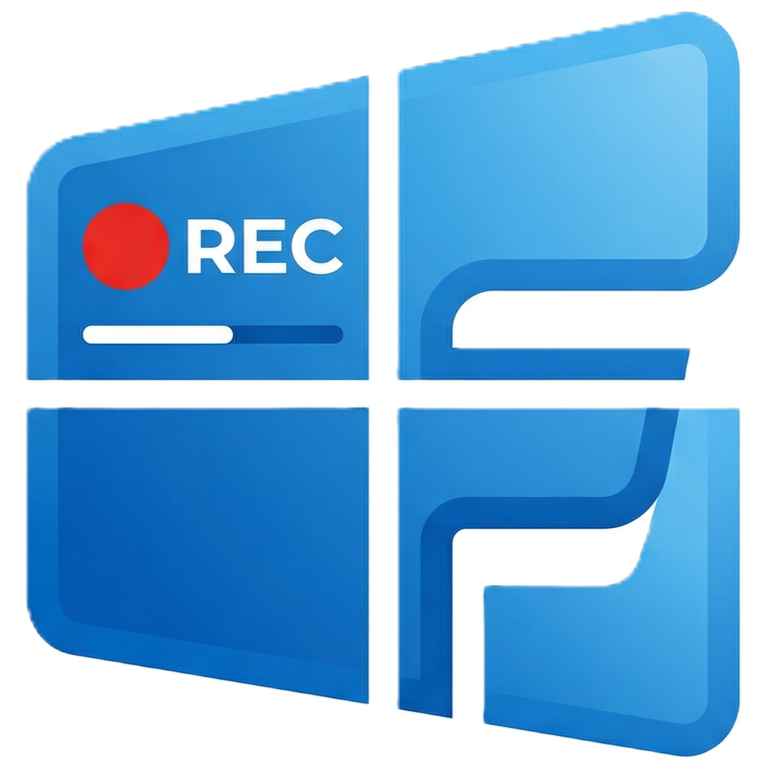
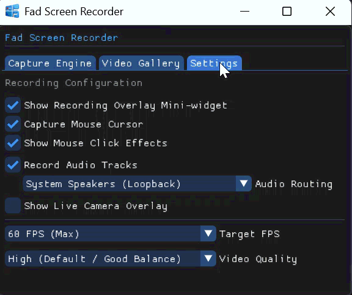
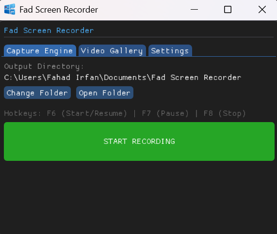
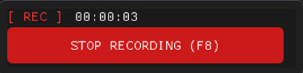
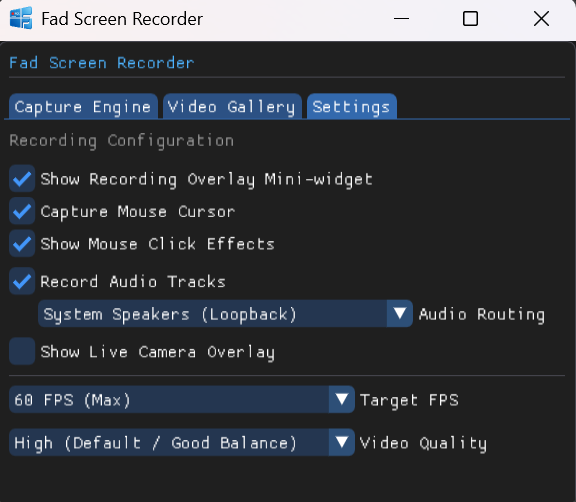

<div align="center">



# 🎬 Fad Screen Recorder Pro

**A zero-latency, hardware-accelerated broadcasting and capture suite built in modern C++20.**

[](https://en.cppreference.com/)
[](#)
[](https://ffmpeg.org/)

*Engineered for creators who demand high fidelity without the resource overhead.*

[⬇️ Download Latest Release](#-installation) • [🐛 Report Bug](#) • [✨ Request Feature](#)

</div>

---

## 👁️ Visual Showcase



<details>
<summary><b>Click to view detailed screenshots</b></summary>

### The Dark-Mode Dashboard


### The Floating Mini-Widget


### Video Gallery & File Management


</details>

---

## ✨ Premium Features

Fad Screen Recorder goes beyond basic capture, offering an architecture designed for absolute performance and reliability.

### 🎮 Hardware-Accelerated Video
| Feature | Description |
| :--- | :--- |
| **Zero-Latency Capture** | Bypasses standard memory copies by mapping GPU textures directly via DXGI Desktop Duplication. |
| **Live Scaled Webcam** | Native Media Foundation hooks with CPU-side alpha-blended rendering for circular or square PIP overlays. |
| **Visual Telemetry** | GDI-injected hardware cursor tracking and vivid left/right mouse click ripple effects. |

### 🎙️ Professional Audio Routing
* **True Loopback:** Flawless system audio capture via WASAPI `eConsole` and `eMultimedia` endpoints.
* **Dual-Mix Engine:** Mathematically mixes floating-point microphone and speaker data in real-time, complete with hard-clipping safeguards.

### ⚙️ Workflow & Control
* **Non-Destructive Pausing:** Chronological timestamp calculation ensures you can pause and resume without corrupting the FFmpeg `.mp4` pipeline.
* **Floating Mini-Widget:** A borderless, always-on-top overlay for live telemetry (can be hidden for clean recording).

---

## ⌨️ Global Hotkeys

Control the engine seamlessly while in-game or presenting.

| Action | Shortcut | Behavior |
| :--- | :---: | :--- |
| **Start / Resume** | <kbd>F6</kbd> | Boots the engines or resumes a paused timeline. |
| **Pause** | <kbd>F7</kbd> | Safely halts frame buffering without breaking sync. |
| **Stop & Save** | <kbd>F8</kbd> | Flushes the FFmpeg buffers and securely writes the `.mp4`. |
| **Emergency Abort** | <kbd>ESC</kbd> | Instantly stops recording (when the UI is focused). |

---

## 🛠️ Architecture & Tech Stack

This project was built from the ground up to maximize the efficiency of Windows native APIs.

<div align="center">

| Domain | Core Technology | Implementation |
| :--- | :--- | :--- |
| **Language** | ISO C++20 | Core engine threading and atomic state management. |
| **Graphics** | DirectX 11 / DXGI | Direct VRAM frame acquisition. |
| **GUI** | Dear ImGui | Win32 / DX11 backend implementation. |
| **Audio** | WASAPI | Core Audio API for loopback and microphone capture. |
| **Camera** | Media Foundation | `MFPlat` / `MFReadWrite` for live raw pixel parsing. |
| **Encoding** | FFmpeg | `libavcodec`, `libswresample`, `libx264` integration. |

</div>

---

## 🚀 Installation

### For End Users
1. Navigate to the **[Releases](#)** tab.
2. Download the latest `FadScreenRecorder_Setup.exe`.
3. Run the installer and launch the application.

### For Developers (Building from Source)
You will need **Visual Studio 2022** and **vcpkg**.

```bash
# 1. Install dependencies via vcpkg
vcpkg install ffmpeg[core,x264]:x64-windows
vcpkg install imgui[core,dx11,win32-binding]:x64-windows
vcpkg install nlohmann-json:x64-windows

# 2. Clone the repository
git clone https://github.com/Fahad23104/Fad-Screen-Recorder.git